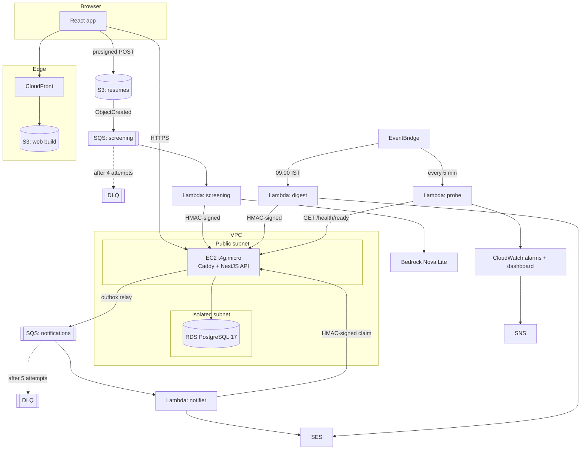
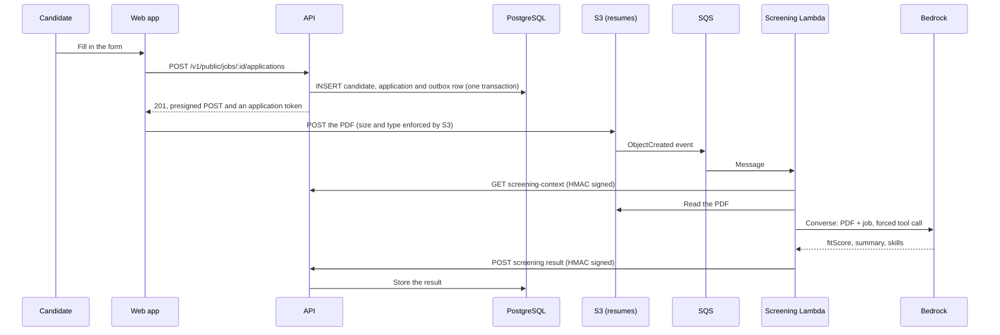
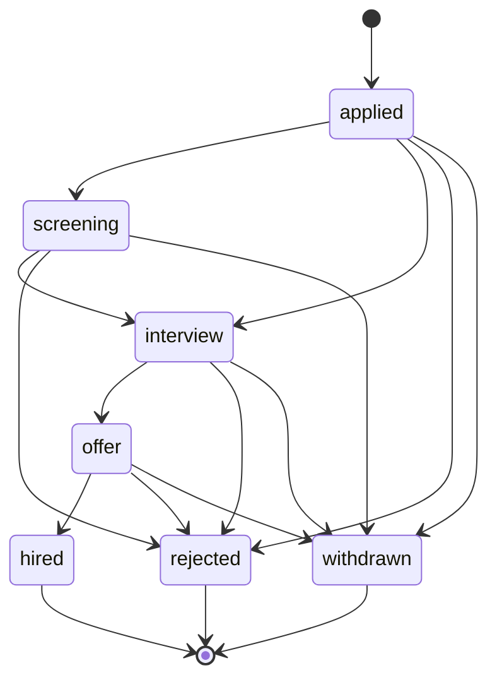
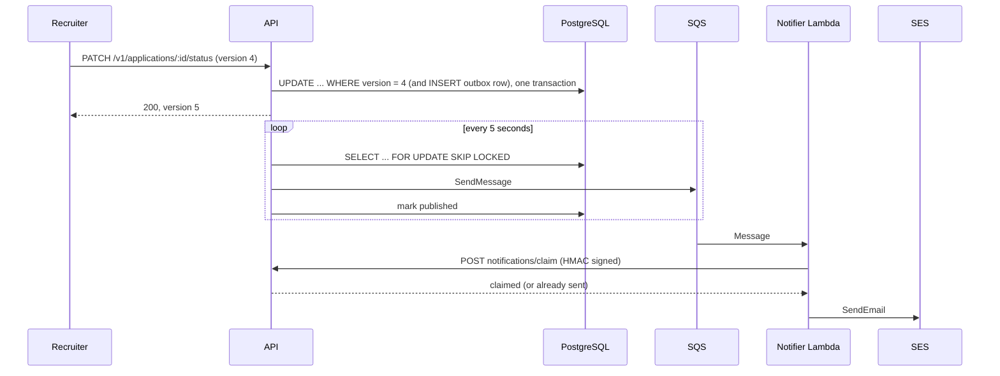

# Architecture

HireFlow has one synchronous path (browser to API to database) and three asynchronous ones
(screening, notifications, scheduled jobs). They meet in two places only: the API's database,
and the API's signed internal endpoints. Nothing else shares state.

## The whole system

The API instance is the only thing in the public subnet. The database has no route to the
internet and accepts connections from the API's security group alone. The Lambdas run outside
the VPC and call the API over HTTPS like any other client, which is why the stack needs no NAT
gateway.

## Applying for a job

Applying also writes an outbox row, so the candidate gets a "we received your application" email
through the same path as every later status email.

Applying twice with the same email answers `200` and no upload ticket, so a second request
cannot replace the first resume. A candidate who lost the page can ask for a fresh ticket with the
application token they were given.

## Moving an application through the pipeline

`hired`, `rejected` and `withdrawn` are terminal. The rules live in
[`status-machine.ts`](../api/src/applications/status-machine.ts) and are tested as a table, so a
new status cannot be added without deciding where it can go.

A change to `interview`, `offer`, `hired` or `rejected` writes an outbox row in the same
transaction as the status update:

## What each piece is responsible for

| Piece | Owns | Does not do |
|---|---|---|
| API (NestJS) | Every write to PostgreSQL, authentication, the state machine, presigning uploads, the outbox | Read resumes, call Bedrock, send mail |
| Screening Lambda | Reading a resume, one Bedrock call, reporting the result | Touch the database |
| Notifier Lambda | Rendering and sending one email per status change | Decide who gets an email |
| Digest Lambda | Asking the API for stale applications and mailing a list | Change any data |
| Probe Lambda | Calling `/health/ready` from outside and publishing a metric | Anything else |

Keeping all database writes in one service is deliberate. There is one place to look when a row is
wrong, and one set of rules (the state machine, the version check) that cannot be bypassed by a
worker with direct access.

## How the pieces trust each other

| From | To | Mechanism |
|---|---|---|
| Browser | API | Short-lived JWT (`typ: access`) for recruiters, a separate `typ: application` JWT for a candidate's own upload ticket |
| Browser | S3 | Presigned POST. The signed policy fixes the key, the content type (`application/pdf`) and the size (1 byte to 5 MB) |
| Lambda | API | `HMAC-SHA256(secret, timestamp.METHOD.pathAndQuery.sha256(body))`, rejected when the timestamp is more than 300 seconds off |
| API instance | AWS | Instance role, scoped to one bucket, one queue, its own secrets and its own SSM parameters |
| Lambda | AWS | One role per function. Only the screening function can call Bedrock, and only one model |
| GitHub Actions | AWS | OIDC token exchanged for one hour of credentials, for the `main` branch only |

The HMAC scheme has a fixed test vector (`c507f597...`) computed with `openssl` and Python, not
with the code under test. The API tests and the Lambda tests both assert it, so the two sides
cannot drift apart without a test failing.

## Failure modes, and what happens

| What fails | Result |
|---|---|
| Bedrock throttles or times out | The message returns to the queue after its visibility timeout and is tried again, up to 4 attempts in all, then parked in the DLQ and an alarm fires |
| A file that is not a readable PDF, or is over 5 MB | Treated as permanent: the application is marked `failed` straight away and the message is not retried. A failure that arrives after a success is ignored, so it cannot undo a good result |
| The API is down when a Lambda calls it | The Lambda throws, SQS retries. The uptime probe has already raised `api-down` |
| SQS delivers a notification twice | The second claim finds the row already taken and returns without sending |
| SES fails after a claim was taken | The Lambda releases the claim, so the retry can send |
| Two recruiters change the same application at once | One wins. The other gets `409` with the current version |
| Two relay loops read the outbox at once | `SKIP LOCKED` gives each a different batch, so nothing is sent twice by the relay |
| A deploy restarts the API | For a few seconds Caddy answers `502`. Any worker call in that window fails, its message goes back to the queue and is retried after the visibility timeout. Observed live: 8 screenings hit a restart, all 8 completed on retry, none reached the DLQ |
| A deploy ships a broken release | `activate.sh` sees `/health/ready` fail, relinks the previous release and exits non-zero |
| The instance host is impaired | A CloudWatch alarm asks EC2 to recover it, and emails the alert address |
